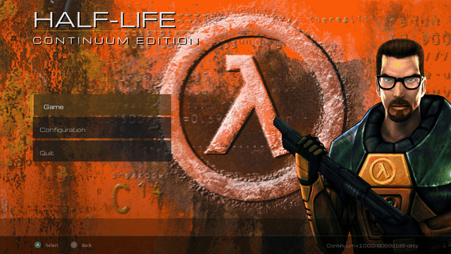

I'm a big fan of the Half-Life series and of game engines, but I had never really dug into GoldSrc. Xash3D gave me a place to explore that interest, and Claude Fable helped me jump straight into adding the features I wanted.

I started on June 9, 2026, choosing Continuum as a demanding test of the leap forward I saw in Fable.

The result is **Half-Life: Continuum Edition**, a fork of Xash3D-FWGS that plays the original game with changes to the engine and interface. The two pieces I'm proudest of are the entity contact shadows and seamless level transitions.

I directed the project extensively, from the initial plans through repeated reviews of each feature. Claude carried out all of the research and implementation, using a mixture of Fable and Opus.

_A tour of Continuum, from the main menu to gameplay and configuration._

## Entity contact shadows

Continuum adds soft contact shadowing beneath moving characters and props. It helps them look grounded in the scene, with the shadow fading as an entity lifts away from the floor. This is separate from the optional world ambient occlusion, which adds shading to corners and recesses in the level.

The [ambient-occlusion notes](https://github.com/bishopdynamics/Continuum/blob/00ba9c640625a0663df3470910419db132969c9b/doc/ambient-occlusion.md) describe the two systems and their controls.

## Seamless level transitions

Half-Life's campaign is divided into maps. Continuum keeps parsed world models resident in memory and holds transition state in memory too, so crossing a level boundary no longer brings up a loading screen.

During the swap, the last rendered frame remains on screen briefly and audio continues across the transition. There can still be a short frame hold; the aim is to keep the journey through the campaign feeling continuous.

The [level-streaming notes](https://github.com/bishopdynamics/Continuum/blob/00ba9c640625a0663df3470910419db132969c9b/doc/level-streaming.md) explain how world residency, transition state, and preloading work together.

## A controller-first front end

The unified menu brings game selection and configuration into one interface designed for a gamepad, with mouse and keyboard support as well. Installed expansions and mods appear in the game picker, and the settings pages expose Continuum's additions alongside existing engine options.

## How we built it

My role was project manager. I crafted the initial plans and iterated on them with Fable. Claude then researched and implemented the work, presented the results, and we went through many rounds of refinement until I was happy with the feature. We repeated that process for each addition to Continuum.

The development tools improved as we went. Claude implemented a debugging connection through MCP that exposed the live engine state, captured screenshots directly, and simulated input without taking over my real mouse. That gave Claude direct access to the running engine for testing, verification, and troubleshooting.

Gameplay capture and demo-playback tools served two purposes: returning to specific trouble spots during testing, and recording footage to demonstrate the finished features. The work included building the tools that made those repeated checks and refinements more efficient.

## Try Continuum

Continuum builds on the work of the Xash3D-FWGS project and runs Half-Life's original game content. You need your own copy of the game data; it is not included in the download.

The [project README](https://github.com/bishopdynamics/Continuum) has setup instructions, and the [initial release](https://github.com/bishopdynamics/Continuum/releases/tag/v1.0.0.0) includes Linux, macOS Apple Silicon, Windows, and Flatpak downloads. The engine, menu, and game SDK forks are linked from the repository.
